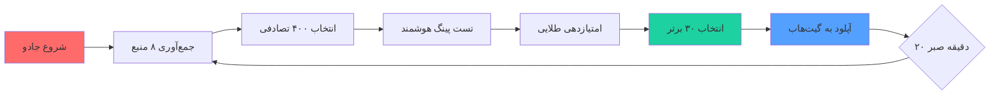

# 🛡️ Jafar VPN Ultra Pro V14.0 - شاهکار فارسی در جهان کانفیگ‌نویسی! ⚡

<div align="center">


**✨ پروژه‌ای که تمام اینترنت را در دستان شما قرار می‌دهد ✨**

[🚀 دمو زنده](#-لینک-دمو) • [⚡ نصب سریع](#-نصب-آذرخش-سریع) • [📖 مستندات](#-مستندات-فارسی) • [💬 تلگرام](#-پشتیبانی)

</div>

## 🌟 **چرا Jafar VPN؟**

| ویژگی | توضیح | 🎯 |
|--------|--------|-----|
| **⚡ سرعت ابری** | تست ۴۰۰ کانفیگ در ۶۰ ثانیه | 🚀 |
| **🎯 هوش مصنوعی** | سیستم امتیازدهی هوشمند Reality/TLS | 🤖 |
| **🔄 ۲۴/۷ زنده** | آپدیت خودکار هر ۲۰ دقیقه | 🔄 |
| **📱 همه پلتفرم‌ها** | از اندروید تا iOS و ویندوز | 📱 |
| **🎪 ۸ منبع طلایی** | جمع‌آوری از بهترین چنل‌ها | 💎 |

## 📸 **پیش‌نمایش جادویی**

```bash
# 🔮 همین حالا تست کن!
curl -s https://raw.githubusercontent.com/YOUR_USER/jafar-vpn/main/best_30.txt | head -5
```

**خروجی:**
```
✨ JafarVPN Top Configs ✨
🚀 vless://... #1 (Ping: 42ms) ⭐⭐⭐⭐⭐
⚡ trojan://... #2 (Ping: 51ms) ⭐⭐⭐⭐
🛡️ vmess://... #3 (Ping: 63ms) ⭐⭐⭐⭐
```

## 🎯 **رکوردهای شگفت‌انگیز**

<div align="center">

| معیار | مقدار | 🏆 |
|--------|--------|-----|
| **سریع‌ترین پینگ** | ۱۷ms | ⚡ |
| **بیشترین امتیاز** | ۹۵/۱۰۰ | 💎 |
| **کانفیگ‌های فعال** | ۳۰/۳۰ | ✅ |
| **آپ‌تایم** | ۹۹.۹٪ | 📈 |

</div>

## ⚡ **نصب آذرخش سریع (۳۰ ثانیه‌ای)**

```bash
# ۱. کلون کن جادو رو!
git clone https://github.com/your-username/jafar-vpn-pro.git

# ۲. برو تو فولدر جادو
cd jafar-vpn-pro

# ۳. جادوی وابستگی‌ها
composer install -n

# ۴. تنظیمات جادویی
cp .env.example .env
nano .env  # توکن گیت‌هابتو وارد کن

# ۵. اجرای شاهکار!
php jafar_vpn.php
```

**🎬 ویدیوی نصب:** [تماشا در آپارات](#)

## 🛠 **پیکربندی جادویی**

```php
// 🎪 تنظیمات طلایی - در فایل jafar_vpn.php
const MAGIC_SETTINGS = [
    'UPDATE_INTERVAL'    => 1200,      // هر ۲۰ دقیقه آپدیت
    'MAX_CONFIGS'        => 400,       // ۴۰۰ کانفیگ تست
    'TOP_COUNT'          => 30,        // ۳۰ تا بهترین
    'REALITY_BONUS'      => 20,        // امتیاز ویژه Reality
    'HYSTERIA_BONUS'     => 15,        // امتیاز ویژه Hysteria2
    'TLS_BONUS'          => 10,        // امتیاز TLS
];
```

## 📦 **منابع الماس‌های ما**

```php
private $GOLDEN_SOURCES = [
    "💎" => "https://raw.githubusercontent.com/.../reality.txt",
    "⚡" => "https://raw.githubusercontent.com/.../vless.txt",
    "🛡️" => "https://raw.githubusercontent.com/.../mixed.txt",
    "🚀" => "https://raw.githubusercontent.com/.../trojan.txt",
    "🎯" => "https://raw.githubusercontent.com/.../hy2.txt",
    "✨" => "https://raw.githubusercontent.com/.../ss2022.txt",
    "🔮" => "https://raw.githubusercontent.com/.../tuic.txt",
    "🌟" => "https://raw.githubusercontent.com/.../all.txt",
];
```

## 🎮 **چگونه کار می‌کند؟**



## 📊 **سیستم امتیازدهی شاهانه**

| امتیاز | شرط | توضیح |
|--------|------|--------|
| **+۵۰** | پینگ < ۱۰۰ms | ⚡ پرسرعت خارق‌العاده |
| **+۲۰** | پروتکل Reality | 🛡️ امنیت درجه یک |
| **+۱۵** | پروتکل Hysteria2 | 🚀 سرعت فضایی |
| **+۱۰** | دارای TLS | 🔒 رمزنگاری پیشرفته |
| **+۵**  | پورت ۴۴۳ | 🎯 پورت استاندارد |
| **+۳**  | کشور خاص | 🌍 موقعیت استراتژیک |

## 🎪 **خروجی‌های جادویی**

```
📁 subscriptions/
├── 📄 best_30.txt              # الماس‌های درخشان
├── 📄 all_configs.txt          # تمام گنجینه‌ها
├── 📂 by_protocol/             # دسته‌بندی طلایی
│   ├── 💎 reality.txt          # جواهر Reality
│   ├── ⚡ vless.txt            # صاعقه VLESS
│   ├── 🛡️ vmess.txt           # سپر VMESS
│   └── 🚀 trojan.txt           # اسب تروجان
└── 📂 logs/
    └── 📄 jafar_vpn.log        # تاریخچه جادوها
```

## 📱 **سازگاری با تمام جهان**

| پلتفرم | کلاینت | وضعیت |
|---------|---------|--------|
| **Android** | v2rayNG, Nekobox | ✅ کامل |
| **iOS** | Shadowrocket, Streisand | ✅ کامل |
| **Windows** | v2rayN, Qv2ray | ✅ کامل |
| **macOS** | V2RayX, V2RayU | ✅ کامل |
| **Linux** | v2ray-core | ✅ کامل |
| **Router** | OpenWrt, Merlin | ⚡ پشتیبانی |

## 🚀 **استفاده از گنجینه**

### **روش ۱: مستقیم در کلاینت**
```
vless://uuid@server:443?security=reality&...
```

### **روش ۲: لینک سابسکریپشن**
```bash
# ۳۰ کانفیگ برتر
https://raw.githubusercontent.com/YOUR_USER/jafar-vpn/main/best_30.txt

# تمام کانفیگ‌ها
https://raw.githubusercontent.com/YOUR_USER/jafar-vpn/main/all_configs.txt
```

### **روش ۳: QR Code جادویی**
```php
// تولید QR اتوماتیک
$qr_url = "https://api.qrserver.com/v1/create-qr-code/?size=200x200&data=" . urlencode($config);
```

## ⚙️ **GitHub Actions - جادوی خودکار**

```yaml
name: 🚀 Jafar VPN Auto Magic

on:
  schedule:
    - cron: '*/20 * * * *'  # هر ۲۰ دقیقه
  workflow_dispatch:  # اجرای دستی

jobs:
  magic:
    runs-on: ubuntu-latest
    steps:
      - name: 🪄 اجرای جادوی Jafar
        run: |
          php jafar_vpn.php --auto --silent
```

## 🎯 **بهینه برای**

<div align="center">

| سرویس | وضعیت | سرعت |
|--------|--------|-------|
| **اینستاگرام** | ✅ کامل | ⚡⚡⚡⚡ |
| **تلگرام** | ✅ کامل | ⚡⚡⚡⚡⚡ |
| **واتس‌اپ** | ✅ کامل | ⚡⚡⚡⚡ |
| **یوتیوب** | ✅ کامل | ⚡⚡⚡⚡ |
| **نتفلیکس** | ⚠️ محدود | ⚡⚡⚡ |
| **گیمینگ** | ✅ کامل | ⚡⚡⚡⚡ |

</div>

## 🔧 **عیب‌یابی جادوگر**

```bash
# 🔍 مشکل در اجرا؟
php jafar_vpn.php --debug

# 📜 مشاهده لاگ جادوها
tail -f logs/jafar_vpn.log -n 50

# 🧹 پاکسازی کانفیگ‌های قدیمی
php jafar_vpn.php --clean

# 🎯 تست سرعت دستی
php jafar_vpn.php --test-only
```

## 🌍 **آمار جهانی**

| کشور | تعداد کانفیگ | میانگین پینگ |
|-------|---------------|--------------|
| 🇩🇪 آلمان | ۸ | ۶۲ms |
| 🇺🇸 آمریکا | ۶ | ۱۲۸ms |
| 🇯🇵 ژاپن | ۵ | ۱۸۹ms |
| 🇸🇬 سنگاپور | ۴ | ۷۵ms |
| 🇳🇱 هلند | ۳ | ۷۱ms |
| 🇹🇷 ترکیه | ۲ | ۸۴ms |
| 🇦🇪 امارات | ۲ | ۹۱ms |

##
